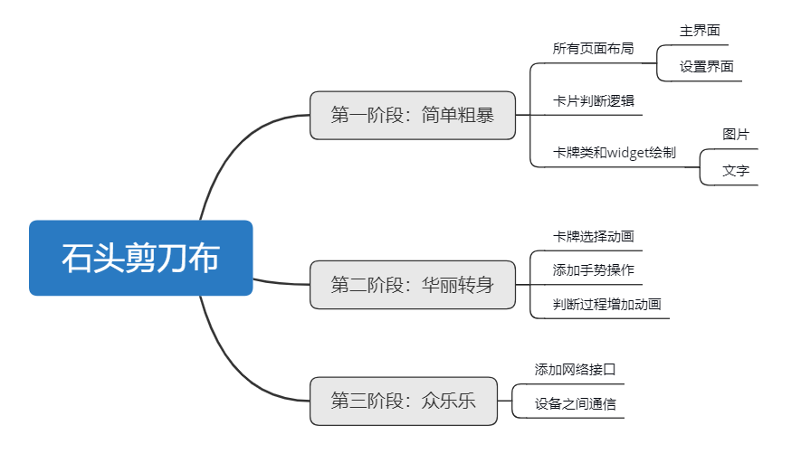

# Flutter App——石头剪刀布

## 项目说明

初学 Flutter 极易上手的 App，目前1.0版本所用到的功能有

- widget 相关绘制问题解决
- 页面之间传参与传回
- 点击响应事件刷新UI布局

欢迎大家 Star！有什么相关改进或者想法可以issue~

## 项目设计

## 项目开发笔记

关于项目相关技术与代码解释可以参考我的[个人博客](https://allenmistake.github.io/)
